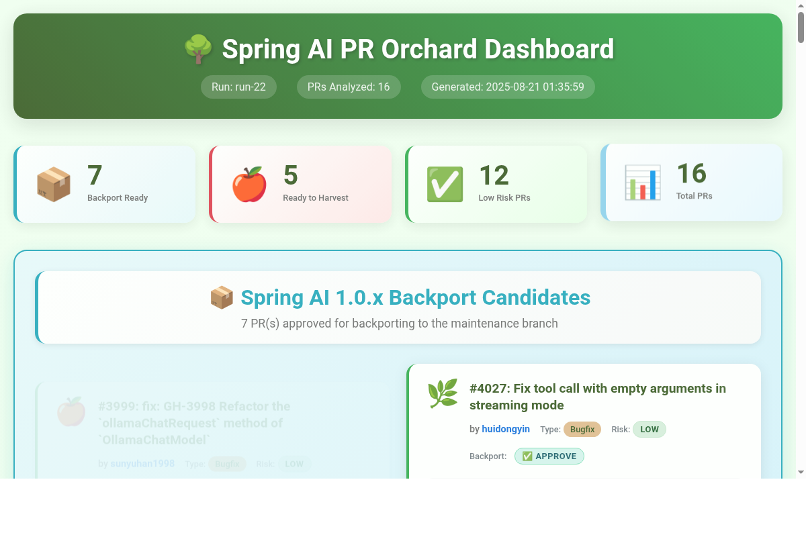

# Spring AI PR Merge & Review Automation

Automated end-to-end PR merge pipeline for [Spring AI](https://github.com/spring-projects/spring-ai). Fetches a PR, rebases it onto main, resolves conflicts, fixes compilation errors, runs tests, and generates a comprehensive AI-powered analysis report -- in a single command.

## How It Works

The pipeline alternates between deterministic steps (free, instant) and LLM steps (reasoning, judgment). About half the steps are deterministic -- the LLM only fires when reasoning is actually needed.


**Pipeline stages:**

1. **Fetch PR & branch** -- clone/update Spring AI repo, check out PR branch
2. **Compile check** -- pre-rebase compilation validation (fail-fast)
3. **LLM fix errors** -- AI-powered compilation error resolution (if needed)
4. **Rebase against main** -- rebase onto latest upstream
5. **Resolve conflicts** -- AI-powered semantic conflict resolution (if needed)
6. **Compile check** -- post-rebase compilation validation
7. **Security review** -- risk and quality assessment
8. **Squash & LLM commit msg** -- intelligent squashing with AI-generated commit message
9. **Run tests** -- modular test discovery and execution
10. **Analyze conversation** -- AI analysis of GitHub discussions and requirements
11. **Assess risk** -- security, quality, and breaking change assessment
12. **Evaluate solution** -- technical architecture and implementation analysis
13. **Generate report** -- comprehensive markdown and HTML report

## Batch Processing

Run the pipeline across every open PR, rank by difficulty, and generate a dashboard. 16 PRs analyzed, risk-scored, and organized from low-hanging fruit to complex -- in a single batch run.



[View live dashboard (htmlpreview)](https://htmlpreview.github.io/?https://github.com/markpollack/spring-ai-project-mgmt/blob/main/reports/pr-review/pr_orchard_dashboard.html) | [Dashboard HTML source](../reports/pr-review/pr_orchard_dashboard.html)

## Quick Start

```bash
cd pr-review

# Single PR -- full pipeline
python3 pr_workflow.py 3914

# Batch -- analyze multiple PRs with dashboard
python3 batch_pr_workflow.py 3920 3919 3921 3922

# Report only (assumes PR already prepared)
python3 pr_workflow.py --report-only 3914

# Cleanup
python3 pr_workflow.py --cleanup 3914
```

## Key Design Decisions

- **Fail-fast compilation** -- two-stage compile check (pre-rebase and post-rebase) catches broken PRs in ~5 seconds before wasting time on downstream steps
- **Human handoff for stubborn errors** -- AI makes one focused attempt at compilation fixes, then hands off with clear guidance and `--resume-after-compile` to continue
- **Conservative AI usage** -- deterministic steps handle the scaffolding; LLM steps only fire for reasoning tasks (conflict resolution, analysis, commit messages)
- **Sonnet model for cost control** -- all Claude Code calls explicitly use Sonnet to prevent accidental Opus usage; all components complete under 90 seconds
- **File access boundaries** -- prompts restrict Claude Code to PR-specific files only (typically 5-7 files), preventing exploration of the full Spring AI codebase

## Related

- [Blog post: I Read My Agent's Diary](https://pollack.ai/posts/2026/03/i-read-my-agents-diary/) -- how this pipeline was built and measured
- [Agent Journal](https://github.com/markpollack/agent-journal) -- behavioral instrumentation for agent runs
- [AgentClient](https://github.com/spring-ai-community/agent-client) -- portable CLI wrapper used by this pipeline

---

# Detailed Usage

## Quick Start - High Level Commands

### Single PR Review with HTML Report (Most Common)
```bash
# Generate comprehensive analysis with both Markdown and HTML reports
python3 pr_workflow.py 3914

# The workflow automatically generates:
# - 📄 Markdown report: reports/review-pr-3914.md
# - 🌐 HTML report: reports/review-pr-3914.html
# - 🔗 Browser URL: file:///path/to/reports/review-pr-3914.html

# Report-only mode (faster, assumes PR already prepared)
python3 pr_workflow.py --report-only 3914

# Control HTML generation
python3 pr_workflow.py --no-html 3914          # Markdown only
python3 pr_workflow.py --html-only 3914        # HTML only
python3 pr_workflow.py --open-browser 3914     # Auto-open HTML in browser
```

**📊 HTML Report Features:**
- Interactive, modern web interface with expandable sections
- Risk assessment visualization with color-coded indicators
- File changes explorer grouped by type (Java, tests, config, docs)
- Conversation analysis and solution assessment details
- Backport recommendations and commit message preview
- Mobile-responsive design for viewing on any device

### Human-Assisted Compilation Fixing
```bash
# Human-assisted workflow: Let AI try once, then hand off to human
python3 pr_workflow.py 3914

# When compilation errors remain, fix them manually, then resume:
python3 pr_workflow.py --resume-after-compile 3914
```

**Why this workflow?** The AI makes one focused attempt to fix compilation errors. If issues remain, it hands off to human expertise with clear guidance, then seamlessly continues the full workflow after manual fixes.

### Complete PR Review Workflow
```bash
# Full end-to-end PR review with all features
python3 pr_workflow.py 3386

# Clean workspace first, then run full workflow
python3 pr_workflow.py --cleanup 3386 && python3 pr_workflow.py 3386
```

### Individual Workflow Components
```bash
# Generate comprehensive reports only (assumes PR already prepared)
python3 pr_workflow.py --report-only 3386

# Generate reports with fresh AI analysis (ignore cache, force re-analysis)
python3 pr_workflow.py --report-only --force-fresh 3386

# Skip backport assessment for faster report generation
python3 pr_workflow.py --report-only --skip-backport 3386

# Run tests only (assumes PR already prepared) 
python3 pr_workflow.py --test-only 3386

# Generate workflow plan only (smart analysis & progress tracking)
python3 pr_workflow.py --plan-only 3386

# Clean up all generated files and repositories
python3 pr_workflow.py --cleanup 3386

# Granular cleanup control
python3 pr_workflow.py --cleanup 3386 --cleanup-mode light  # Keep spring-ai repo, delete PR branch
python3 pr_workflow.py --cleanup 3386 --cleanup-mode full   # Remove everything

# Preview what would happen without executing
python3 pr_workflow.py --dry-run 3386
```

#### Plan-Only Mode: Smart Pre-Analysis

The `--plan-only` mode is a lightweight analysis tool that generates an intelligent workflow plan without executing any changes:

**What it does:**
- 🔍 **Smart Analysis**: Detects compilation errors, merge conflicts, and potential issues
- 📋 **Progress Tracking**: Creates a detailed checklist plan in `/plans/enhanced-plan-pr-XXXX.md`
- ⚡ **Fast Execution**: Completes in seconds (no compilation, testing, or heavy operations)
- 🎯 **Issue Preview**: Shows exactly what problems need to be addressed before full workflow

**When to use:**
- **Before full workflow**: Preview what issues exist and estimate time needed
- **After cleanup**: Verify PR branch is properly set up (as demonstrated in cleanup testing)
- **Troubleshooting**: Quick check of current PR state without making changes
- **Planning**: Understand scope and complexity before committing to full workflow

**Example output location:** `/plans/enhanced-plan-pr-3914.md`

**Perfect for:**
- Quick PR assessment and planning
- Validating clean workspace state after cleanup
- Understanding workflow requirements before execution
- Team coordination and issue prioritization

### Workflow Step Control Options
```bash
# Skip individual steps if needed
python3 pr_workflow.py --skip-squash 3386           # Skip commit squashing
python3 pr_workflow.py --skip-compile 3386          # Skip compilation check
python3 pr_workflow.py --skip-tests 3386            # Skip test execution
python3 pr_workflow.py --skip-docs 3386             # Skip Antora documentation build
python3 pr_workflow.py --skip-report 3386           # Skip report generation
python3 pr_workflow.py --skip-commit-message 3386   # Skip AI-powered commit message generation

# Conflict resolution control
python3 pr_workflow.py --no-auto-resolve 3386       # Disable automatic conflict resolution

# Force operations
python3 pr_workflow.py --force 3386                 # Force overwrite existing branches
```

## 📋 What This Solution Provides

The Spring AI PR Review system provides a **complete automated workflow** for efficiently reviewing pull requests with AI assistance. It transforms a complex, error-prone manual process into a reliable, comprehensive automated analysis.

### 🎯 Core Value Proposition

**Before**: Manual PR review required multiple complex steps, frequent conflicts, manual error resolution, and inconsistent analysis quality.

**After**: Single command provides complete PR preparation, intelligent conflict resolution, automated compilation fixes, comprehensive testing, professional AI-generated commit messages, and professional-grade AI-powered analysis reports.

## 🔄 Complete Workflow Overview

### Visual Workflow Diagram

```
🚀 START: python3 pr_workflow.py 3386
    │
    ▼
┌─ Check Prerequisites ─────────────────────┐
│  • GitHub CLI authenticated              │
│  • Claude Code CLI available             │
│  • Maven/Java environment ready          │
└───────────────────────────────────────────┘
    │
    ▼
📁 PHASE 1: Repository Setup & PR Preparation
    │
    ├─► Clone/Update spring-ai repository
    ├─► Fetch PR branch via GitHub CLI  
    ├─► Create clean isolated PR branch
    └─► Validate PR state and structure
    │
    ▼
🔧 PHASE 2: Initial Compilation & Error Fixing
    │
    ├─► Run initial Maven compilation check
    │
    ├─ Compilation errors found? ────┐
    │                                ▼
    │                           🤖 AI-powered compilation fixing
    │                           │   (Claude Code + templates)
    │                           ├─► Detect error types (type mismatch, etc.)
    │                           ├─► Apply template-based fixes
    │                           ├─► Add type casts, fix imports
    │                           └─► Iterative resolution (up to 3 attempts)
    │                                │
    │                                ├─ More errors? ─┐
    │                                │                ▼
    │                                │            (Loop back)
    │                                │                │
    └─ Clean compilation ◄───────────┴────────────────┘
    │
    ├─► Run Java formatter on modified files
    ├─► Commit compilation fixes if any were applied
    └─► Validate clean build state
    │
    ▼
📝 PHASE 3: Intelligent Commit Management
    │
    ├─► Analyze existing commit structure
    ├─► 🤖 AI-powered intelligent squashing
    ├─► 🤖 Generate professional commit message (Claude Code)
    └─► Prepare for upstream integration
    │
    ▼
⚡ PHASE 4: Conflict Resolution & Integration
    │
    ├─► Rebase against upstream main branch
    │
    ├─ Merge conflicts detected? ────┐
    │                                ▼
    │                           🤖 AI conflict resolution
    │                           │   (Claude Code analysis)
    │                           ├─► Apply semantic fixes
    │                           └─► Verify resolution
    │                                │
    └─ No conflicts ◄────────────────┘
    │
    ▼
🔧 PHASE 5: Post-Rebase Compilation Check
    │
    ├─► Run Maven compilation after rebase
    │
    ├─ New compilation errors from rebase? ──┐
    │                                        ▼
    │                                   🤖 AI-powered error fixing
    │                                   │   (Claude Code templates)
    │                                   ├─► Handle API conflicts from upstream
    │                                   ├─► Fix dependency version issues
    │                                   └─► Apply rebase-specific fixes
    │                                        │
    │                                        ├─ More errors? ─┐
    │                                        │                ▼
    │                                        │            (Loop back)
    │                                        │                │
    └─ Clean post-rebase compilation ◄───────┴────────────────┘
    │
    ├─► Run Java formatter on any new fixes
    └─► Commit post-rebase fixes if needed
    │
    ▼
🧪 PHASE 6: Comprehensive Testing
    │
    ├─► Discover tests affected by PR changes
    ├─► Execute modular Maven test suites
    ├─► Handle container-based tests (Ollama, etc.)
    ├─► Collect detailed test results and logs
    └─► Generate test execution summary
    │
    ▼
📊 PHASE 7: AI Analysis & Report Generation
    │
    ├─► Collect comprehensive PR context & metadata
    ├─► 🤖 AI conversation analysis (Claude Code)
    │    └─► Analyze GitHub discussions & requirements
    ├─► 🤖 Technical solution assessment (Claude Code)  
    │    └─► Evaluate architecture impact & patterns
    ├─► 🤖 Security & quality risk analysis (Claude Code)
    │    └─► Identify risks & breaking changes
    └─► Generate comprehensive markdown report
    │
    ▼
✅ WORKFLOW COMPLETE
    │
    ├─► Professional analysis report: /reports/review-pr-XXXX.md
    ├─► Detailed test logs: /reports/test-logs-pr-XXXX/
    ├─► PR ready for review with clean state
    └─► All conflicts resolved, compilation clean, tests executed

═══════════════════════════════════════════════════════════════════

🤖 AI INTEGRATION POINTS (Claude Code):
┌────────────────────────────────────────────────────────────────┐
│  1. Initial compilation error fixing (Phase 2)               │
│  2. Professional commit message generation (Phase 3)         │
│  3. Intelligent merge conflict resolution (Phase 4)          │  
│  4. Post-rebase compilation fixes (Phase 5)                  │
│  5. GitHub conversation & requirement analysis (Phase 7)     │
│  6. Technical solution assessment & risk analysis (Phase 7)  │
└────────────────────────────────────────────────────────────────┘

🔄 ITERATIVE LOOPS:
• Compilation errors: Fixed until clean build achieved
• Conflict resolution: Continues until all conflicts resolved  
• Testing: Retries failed tests with different strategies

⚠️  ERROR HANDLING:
• Prerequisites missing → Exit with guidance
• Merge conflicts → AI resolution → Manual fallback if needed
• Compilation errors → AI fixing → Template-based repair
• Test failures → Detailed logging → Continue with warnings
```

### Detailed Step-by-Step Process

When you run `python3 pr_workflow.py 3386`, here's what happens automatically:

### Phase 1: Repository Setup & PR Preparation
1. **Pre-flight Checks**: Auto-detects and cleans stuck git states (rebase, unmerged files)
2. **Repository Management**: Clones/updates Spring AI repository in isolated workspace
3. **PR Checkout**: Uses GitHub CLI to fetch the specific PR branch
4. **Branch Management**: Creates clean PR branch with proper upstream tracking
5. **Initial Validation**: Ensures PR is in valid state for processing

### Phase 2: Intelligent Commit Management
1. **Commit Analysis**: Analyzes PR commit structure and history
2. **Intelligent Squashing**: Uses optimized `git reset --soft` strategy for instant squashing
   - Handles PRs with any number of commits (1-100+)
   - Preserves DCO signatures from all commits
   - 16x faster than interactive rebase for multi-commit PRs
3. **AI-Powered Commit Messages**: Uses Claude Code AI to generate comprehensive, professional commit messages based on PR context, changes, and discussions
4. **Conflict-Aware Rebase**: Rebases against latest upstream with intelligent conflict detection

### Phase 3: AI-Powered Conflict Resolution
1. **Conflict Detection**: Identifies and categorizes merge conflicts by complexity
2. **Claude Code Integration**: Uses Claude Code AI for intelligent conflict resolution
   - Analyzes conflict context and intent
   - Applies semantic understanding to resolve conflicts
   - Maintains code integrity and functionality
3. **Verification**: Ensures all conflicts are properly resolved and code compiles

### Phase 4: Two-Stage Compilation Validation with AI Error Resolution

**Stage 1: Pre-Rebase Compilation Check** (fail-fast)
1. **Early Validation**: Runs before squash/rebase to catch broken PRs immediately
2. **AI Error Resolution**: Makes one focused attempt to fix compilation errors using Claude Code
   - Understands Java/Spring patterns and conventions
   - Fixes method signature issues, import problems, API changes
   - Uses MCP Java SDK for accurate type information
3. **Cost Savings**: Prevents wasting time on obviously broken PRs (~5 seconds)

**Stage 2: Post-Rebase Compilation Check** (integration validation)
1. **Final Merged State**: Runs after rebasing against latest upstream main
2. **Catches Upstream Incompatibilities**: Detects issues like:
   - API changes in upstream that affect this PR
   - Method signature changes in base classes
   - Interface changes that require implementation updates
3. **AI Error Resolution**: Same intelligent fixing as Stage 1
4. **Human Handoff**: If errors remain after both stages, stops with clear guidance
   - Shows exactly what compilation errors still exist
   - Provides the working directory path
   - Instructions to resume with `--resume-after-compile`

**Why Two Stages?**
- Total overhead: ~10 seconds (5s each)
- Maximum safety: Catches both PR bugs and rebase-introduced incompatibilities
- AI fixes available at both stages for automated resolution

### Phase 5: Comprehensive Testing
1. **Test Discovery**: Identifies all tests affected by PR changes
2. **Modular Execution**: Runs tests by Maven module for efficient execution
3. **Container Management**: Handles Docker container tests (like Ollama) appropriately
4. **Result Collection**: Captures detailed test results, logs, and failure analysis
5. **Performance Tracking**: Records execution times and success rates

### Phase 6: AI-Powered Analysis & Reporting
1. **Context Collection**: Gathers comprehensive PR metadata, issue discussions, and code changes
2. **AI Conversation Analysis**: Analyzes GitHub issue discussions and PR conversations to understand:
   - Problem being solved and requirements
   - Design decisions and stakeholder feedback  
   - Outstanding concerns and risks
3. **Solution Assessment**: AI evaluates the technical solution for:
   - Architecture impact and breaking changes
   - Implementation quality and patterns
   - Testing adequacy and coverage
4. **Report Generation**: Creates comprehensive AI-powered analysis report with:
   - Full conversation insights and problem understanding
   - Technical solution assessment and risk analysis  
   - Code quality analysis with recommendations
   - Strategic recommendations and action items

## 📊 Generated Outputs

### Reports Directory Structure
```
reports/
├── review-pr-3386.md              # Comprehensive AI-powered analysis report
└── test-logs-pr-3386/            # Detailed test execution logs and results
    ├── test-summary.md            # Test execution summary
    └── *.log                      # Individual test execution logs
```

### Report Contents

**AI-Powered Analysis Report includes**:
- 🎯 **Problem & Solution Overview**: AI-generated summary of what the PR solves
- 📝 **Issue Context Analysis**: Understanding from GitHub discussions and requirements
- 🔍 **Solution Assessment**: Technical analysis of implementation approach
- ⚠️ **Risk Assessment**: Identified concerns and mitigation strategies  
- 🧪 **Test Results**: Comprehensive test execution analysis with success/failure details
- 🔧 **Code Quality Issues**: Automatic detection of complex methods (>50 lines), ignored/disabled tests, and large files
- 💡 **Recommendations**: Prioritized action items and improvement suggestions
- 📊 **Technical Metrics**: Complexity scores, file analysis, and quality indicators

## 🧠 AI Integration Features

### Claude Code AI Capabilities
- **Intelligent Conflict Resolution**: Understands code context and intent for semantic conflict resolution
- **Human-Assisted Compilation Fixing**: Makes one focused attempt at compilation errors, then hands off to human expertise
- **Code Quality Detection**: Automatically identifies complex methods (>50 lines), ignored/disabled tests (@Ignore/@Disabled), and large files
- **Professional Commit Messages**: Generates comprehensive commit messages that explain the "why" and "what" of changes (currently disabled)
- **Conversation Analysis**: Analyzes GitHub discussions to understand requirements and concerns
- **Solution Assessment**: Evaluates technical approach, architecture impact, and implementation quality
- **Risk Analysis**: Identifies potential issues, breaking changes, and integration concerns
- **Progress Animations**: Real-time visual feedback during long-running AI operations (13-15+ seconds)

### Smart Automation
- **Context-Aware Processing**: Understands Spring AI project patterns and conventions
- **Iterative Problem Solving**: Continues fixing issues until resolution or maximum attempts
- **Quality Preservation**: Maintains code quality while making automated fixes
- **Learning Integration**: Improves based on project-specific patterns and requirements

### Progress Animation System
Long-running AI operations now include visual progress indicators to show the system is actively working:

```
⠋ 🧠 Claude Code analyzing... 7.3s
⠙ 🧠 Claude Code analyzing... 7.8s  
⠹ 🧠 Claude Code analyzing... 8.3s
```

**Features**:
- Professional Braille spinner animation with real-time elapsed time
- Appears during all major AI analysis operations (risk assessment, solution analysis, etc.)
- Thread-safe implementation that doesn't interfere with Claude Code processing
- Configurable and can be disabled if needed

**Benefits**:
- No more wondering if the system is frozen during long AI operations
- Visual confirmation that complex analysis is progressing
- Professional appearance with Unicode-based animations

### AI Failure Tracking & Debugging
The system now includes comprehensive debugging capabilities for AI analysis issues:

**AI Failure Tracker** (`ai_failure_tracker.py`):
- Tracks and categorizes AI component failures during batch processing
- Provides detailed debugging recommendations for common issues
- Generates failure analysis reports to identify patterns and root causes

**Claude Code Wrapper Test Suite** (`test_claude_code_wrapper.py`):
- Comprehensive test suite for systematic Claude Code integration debugging
- Tests availability, simple prompts, JSON output, file reading, and complex scenarios
- Reproduces and isolates specific "Execution error" issues

**Enhanced Error Handling**:
- Improved CompilationErrorResolver with semicolon error patterns and Claude Code integration
- Better JSON parsing from Claude Code markdown responses
- File-based prompt handling to avoid temporary file issues in debugging

## 🔧 Prerequisites

1. **GitHub CLI**: Authenticated with Spring AI repository access
   ```bash
   gh auth login
   gh repo set-default spring-projects/spring-ai
   ```

2. **Claude Code CLI**: For AI-powered analysis and conflict resolution
   ```bash
   # Install from https://claude.ai/code
   claude --version
   ```

3. **Maven Daemon (mvnd)**: For fast compilation and testing
   ```bash
   # Install mvnd for optimal performance
   mvnd --version
   ```

4. **Java 17+**: Required for Spring AI compilation

## 📁 Project Structure

```
pr-review/
├── pr_workflow.py                 # 🎯 Main workflow orchestrator
├── batch_pr_workflow.py           # Batch processing for multiple PRs
├── prepare_backport.py            # Backport preparation script
│
├── AI Analysis Components:
│   ├── ai_conversation_analyzer.py    # AI conversation analysis
│   ├── ai_risk_assessor.py           # Security and risk assessment
│   ├── solution_assessor.py          # Technical solution assessment
│   ├── backport_assessor.py          # Backport candidate evaluation
│   └── commit_message_generator.py   # AI-powered commit messages
│
├── Core Components:
│   ├── enhanced_report_generator.py  # AI-powered report generation
│   ├── html_report_generator.py      # HTML dashboard generation
│   ├── pr_context_collector.py       # GitHub context collection
│   ├── conflict_analyzer.py          # Conflict detection and analysis
│   ├── compilation_error_resolver.py # AI-powered compilation fixing
│   ├── intelligent_squash.py         # Smart commit squashing
│   └── claude_code_wrapper.py        # Claude Code CLI integration
│
├── Supporting Files:
│   ├── github_utils.py               # GitHub utility functions
│   ├── animated_progress.py          # Progress animations
│   ├── ai_failure_tracker.py         # Failure tracking/debugging
│   └── claude_diagnostics.py         # System diagnostics
│
├── Directories:
│   ├── templates/                    # Report and prompt templates
│   ├── context/                      # PR context data and analysis cache
│   ├── reports/                      # Generated analysis reports
│   ├── plans/                        # Workflow plans and progress tracking
│   │   ├── completed/               # Completed implementation plans
│   │   ├── archived/                # Unimplemented plans
│   │   ├── individual-prs/          # PR-specific analysis outputs
│   │   └── progress/                # Implementation tracking
│   ├── spring-ai/                    # Isolated Spring AI repository workspace
│   ├── archived-scripts/             # Deprecated/outdated scripts
│   └── logs/                         # Debug logs and Claude Code responses
```

## 🎯 Use Cases

### Daily PR Review Workflow
- **Spring AI Maintainers**: Complete automated PR analysis with professional reports
- **Feature Review**: Comprehensive analysis of new feature implementations  
- **Bug Fix Validation**: Automated testing and impact analysis of fixes
- **Breaking Change Assessment**: AI-powered analysis of API changes and compatibility

### Batch Processing
```bash
# Basic batch processing (recommended)
python3 batch_pr_workflow.py 3386 3387 3388

# Batch processing with options
python3 batch_pr_workflow.py --dry-run 3386 3387 3388           # Preview what would happen
python3 batch_pr_workflow.py --report-only 3386 3387 3388       # Generate reports only
python3 batch_pr_workflow.py --no-cleanup 3386 3387 3388        # Skip cleanup between PRs
python3 batch_pr_workflow.py --stop-on-error 3386 3387 3388     # Stop on first error
python3 batch_pr_workflow.py --force-reprocess 3386 3387 3388   # Force reprocessing existing reports
python3 batch_pr_workflow.py --open-browser 3386 3387 3388      # Auto-open HTML dashboard
python3 batch_pr_workflow.py --from-scratch 3386 3387 3388      # Fresh start - remove all data first

# Manual batch processing (alternative approach)
for pr in 3386 3387 3388; do
    python3 pr_workflow.py --cleanup $pr
    python3 pr_workflow.py $pr
done
```

### Integration with Review Process
- Generate comprehensive reports for technical leadership review
- Provide AI insights for complex architectural decisions
- Automate repetitive conflict resolution and testing tasks
- Maintain consistent analysis quality across all PRs

## 🚀 Getting Started

1. **Clone and Setup**:
   ```bash
   git clone https://github.com/markpollack/spring-ai-project-mgmt.git
   cd spring-ai-project-mgmt/pr-review
   ```

2. **Install Dependencies**:
   ```bash
   # Ensure GitHub CLI and Claude Code are installed
   gh auth status
   claude --version
   ```

3. **Run Your First PR Analysis**:
   ```bash
   # Complete analysis of PR 3386
   python3 pr_workflow.py 3386
   ```

4. **Review Generated Report**:
   ```bash
   # Check comprehensive AI-powered analysis report
   cat reports/review-pr-3386.md
   ```

## 🛠️ Troubleshooting

### Pre-flight Validation

**Before running workflow**: Run validation script to catch common issues early:
```bash
python3 validate.py                  # Quick check
python3 validate.py --verbose        # Detailed output
```

The validator checks:
- Python syntax for all workflow scripts
- Git repository state (stuck rebase, unmerged files)
- Required dependencies (gh, git, Python 3.8+)

**Problem**: Workflow fails with "needs merge" or rebase errors
**Solution**: The workflow now includes automatic pre-flight checks that clean stuck states. If issues persist:
```bash
# Manual cleanup if needed
cd spring-ai
git rebase --abort
git reset --hard HEAD
git clean -fd
cd ..
```

### AI Analysis Issues

**Problem**: AI assessments show "Manual assessment required due to AI parsing failure"
**Solution**: Use report-only mode to regenerate AI analysis:
```bash
python3 pr_workflow.py --report-only 3386
```

**Problem**: Report shows "no test execution data available"
**Solution**: This typically means the report was generated from cached data before tests ran. The workflow now runs tests BEFORE report generation, so this should be rare. If you see this with old cached data, regenerate:
```bash
python3 pr_workflow.py --report-only 3386
```
The report includes comprehensive test information:
- **Test Plan**: Shows what test files and modules are affected by the PR
- **Quick Reference Table**: Failed tests with status and root cause categorization
- **Error Excerpts**: Detailed stack traces (10 lines) with failure categorization
- **Log Links**: Both relative and absolute paths to test log files
- **Build Artifacts**: Paths to test logs directory and full build log

**Problem**: Claude Code returns "Execution error"
**Solution**: Run the diagnostic test suite:
```bash
python3 test_claude_code_wrapper.py
```

### Re-running Workflows on Existing PR Branches

The workflow is designed to be **safely re-runnable** without losing work or affecting other branches in your spring-ai repository.

**Scenario**: You've already run the workflow for a PR and want to re-run it (e.g., to test changes, regenerate reports, or re-run tests).

**Default Behavior** (no flags):
```bash
python3 pr_workflow.py 4921
```
- If the PR branch exists locally, the workflow **switches to it** without re-fetching
- Your local changes, squashes, and other branches are **preserved**
- Compilation, tests, and reports run on the existing branch state

**Report-Only Mode** (fastest for report regeneration):
```bash
python3 pr_workflow.py --report-only 4921
```
- Assumes PR is already checked out and prepared
- Only regenerates the analysis report
- Skips checkout, compilation, and tests
- Ideal for testing report formatting changes

**Force Fresh Checkout** (overwrites local branch):
```bash
python3 pr_workflow.py --force 4921
```
- Re-fetches the PR from GitHub
- **Overwrites** local branch with GitHub's version
- Use when you need a clean slate from upstream

**Test-Only Mode** (re-run tests without full workflow):
```bash
python3 pr_workflow.py --test-only 4921
```
- Runs tests on the existing branch
- Skips checkout, compilation (assumes already done)
- Creates new test logs in `reports/test-logs-pr-4921/`

**Summary Table**:
| Command | Preserves Local Branch? | Re-runs Tests? | Regenerates Report? |
|---------|------------------------|----------------|---------------------|
| `pr_workflow.py 4921` | ✅ Yes (switches to it) | ✅ Yes | ✅ Yes |
| `--report-only` | ✅ Yes | ❌ No | ✅ Yes |
| `--test-only` | ✅ Yes | ✅ Yes | ❌ No |
| `--force` | ❌ No (overwrites) | ✅ Yes | ✅ Yes |

### Batch Processing Issues

**Problem**: Dashboard shows fewer PRs than processed
**Solution**: This was fixed in recent updates. Context data is now preserved during batch processing.

**Problem**: Compilation errors not being auto-fixed
**Solution**: The CompilationErrorResolver now includes enhanced patterns for common errors like missing semicolons. Re-run the workflow:
```bash
python3 pr_workflow.py --cleanup 3386 && python3 pr_workflow.py 3386
```

### Debug Information

All AI prompts and responses are saved to the `logs/` directory for debugging:
- `claude-prompt-*.txt` - Prompts sent to Claude Code
- `claude-response-*.txt` - Raw responses from Claude Code
- Debug logs include token estimation and performance metrics

### Performance Optimizations

The system includes comprehensive Claude Code performance optimizations for cost control and speed:

#### Model Selection & Cost Control
All Claude Code calls now explicitly use the Sonnet model (`--model sonnet`) to prevent accidental Opus usage:
```bash
# Automatic Sonnet model selection in all AI components
# - Risk Assessment: 45s execution (vs previous 300s timeouts)
# - Conversation Analysis: 30s execution
# - Solution Assessment: 83s execution
# - All components complete successfully under 90 seconds
```

#### System-Level Performance Monitoring
System debugging capabilities provide detailed file access analysis:
```bash
# System debugging logs generated automatically
logs/claude-strace-*.log      # File system access monitoring
logs/claude-lsof-*.log        # Open file descriptor tracking  
logs/claude_process_tracking.log  # Process lifecycle monitoring
```

#### File Access Optimization
**Critical Analysis Boundaries** prevent excessive file exploration:
- **Before**: Claude Code could read 300+ files from entire Spring AI codebase
- **After**: Only reads PR-specific files (typically 5-7 files)
- **Result**: 87% reduction in file access, dramatic performance improvement

**Key Optimization Features:**
- **Boundary Instructions**: Explicit "DO NOT read other files" prompts
- **Absolute File Paths**: Precise file targeting in prompts
- **System Monitoring**: Real-time tracking of file access patterns
- **Cost Optimization**: Consistent Sonnet model usage across all AI calls

#### Performance Diagnostic Tools
```bash
# Validate performance optimizations
python3 claude_diagnostics.py          # Comprehensive health check
python3 test_claude_code_wrapper.py    # Claude Code integration testing
```

These optimizations ensure reliable, fast, and cost-effective AI analysis for all PR review components.

### Cleanup Modes

The system supports two cleanup modes for different use cases:

#### Light Mode (Default)
```bash
python3 pr_workflow.py --cleanup 3914
# OR explicitly:
python3 pr_workflow.py --cleanup 3914 --cleanup-mode light
```

**What it cleans:**
- ✅ Switches back to `main` branch from PR branch
- ✅ **Deletes the PR branch** for fresh state
- ✅ Discards any uncommitted changes
- ✅ Removes generated reports, logs, and context files

**What it preserves:**
- ✅ Keeps the `spring-ai/` repository directory intact
- ✅ Preserves git history and remote configuration
- ✅ Maintains repository for efficient re-use

#### Full Mode (Complete Reset)
```bash
python3 pr_workflow.py --cleanup 3914 --cleanup-mode full
```

**What it does:**
- 🗑️ Completely removes the entire `spring-ai/` directory
- 🗑️ Forces fresh clone on next workflow run
- 🗑️ Use when troubleshooting repository issues

**Benefits of Light Mode:**
- **Faster subsequent runs** - No need to re-clone repository
- **Bandwidth savings** - Repository already available locally
- **Fresh PR state** - PR branch deleted and re-fetched cleanly
- **Efficient** - Optimal balance of cleanliness and performance

## 🔧 Individual Component Scripts

While most users will use the main workflows, you can also run individual components directly:

### Enhanced Report Generation
```bash
# Generate comprehensive AI-powered report for a PR
python3 enhanced_report_generator.py 3386

# Force fresh analysis (ignore cached assessments)
python3 enhanced_report_generator.py --force-fresh 3386

# Specify custom directories
python3 enhanced_report_generator.py 3386 --context-dir /path/to/context --reports-dir /path/to/reports
```

### AI Assessment Scripts
```bash
# Individual AI assessments (useful for debugging)
python3 ai_conversation_analyzer.py 3386      # Analyze PR conversations and requirements
python3 ai_risk_assessor.py 3386             # Security and quality risk assessment  
python3 backport_assessor.py 3386            # Backport candidate evaluation
python3 solution_assessor.py 3386            # Technical solution analysis
python3 commit_message_generator.py 3386     # AI-powered commit message generation
```

### Utility Scripts
```bash
# Pre-flight validation
python3 validate.py                          # Check system state before running workflow
python3 validate.py --verbose                # Detailed validation output

# Intelligent commit squashing
python3 intelligent_squash.py 3386           # Analyze and squash commits automatically
python3 intelligent_squash.py --dry-run 3386 # Preview squash operations

# Backport preparation for Spring AI automation
python3 prepare_backport.py 4102             # Add backport directive to commit message
python3 prepare_backport.py 4102 1.1.x       # Specify target branch (default: 1.0.x)

# Test the Claude Code integration
python3 test_claude_code_wrapper.py          # Comprehensive integration testing
```

### Backport Workflow
The `prepare_backport.py` script prepares PRs for Spring AI's automated backport system:
1. Verifies PR is approved for backport (from AI assessment)
2. Adds "Auto-cherry-pick to X.X.x" and "Fixes #XXXX" to the git commit message
3. Spring AI's automation detects this in the commit and creates backport PR when merged

**Usage Example:**
```bash
cd spring-ai
git checkout pr-branch-name
python3 ../prepare_backport.py 4102
# Type 'y' when prompted to update commit message
```

### Running with Custom Directories
Most AI assessment scripts support custom directory routing for batch processing:
```bash
python3 backport_assessor.py 3386 --context-dir /path/to/context --logs-dir /path/to/logs
python3 ai_conversation_analyzer.py 3386 --context-dir /path/to/context --logs-dir /path/to/logs
```

## 📝 Spring AI Commit Message Conventions

When working with Spring AI repository commits, include these required elements:

### Required Elements

**DCO Compliance (Required):**
```
Signed-off-by: Your Name <your.email@example.com>
```

**For Backports:**
```
Auto-cherry-pick to 1.0.x
```

**For Issue Fixes:**
```
Fixes #1234
```

### Complete Examples

```
feat: add MCP SSE URL configuration documentation and examples

- Provide clear documentation on URL splitting for MCP SSE configuration
- Add comprehensive JavaDoc with URL splitting guidelines  
- Create troubleshooting documentation for common 404 errors
- Include real-world examples of complex URL patterns with tokens

Fixes #3938

Signed-off-by: Mark Pollack <mark.pollack@broadcom.com>
```

```
fix: resolve ChatClient observation context test coverage

- Add comprehensive test coverage for ChatClientObservationContext
- Validate null safety and advisor list handling
- Cover edge cases for Spring AI observability framework

Auto-cherry-pick to 1.0.x
Fixes #4098

Signed-off-by: Developer Name <dev@example.com>
```

### Notes
- **DCO (Developer Certificate of Origin)**: Required for all Spring AI contributions
- **Auto-cherry-pick**: Only needed for fixes that should go to maintenance branches
- **Fixes #**: Links commit to GitHub issue for automatic closure

---

*This tool transforms Spring AI PR review from a complex manual process into an intelligent, automated workflow that provides insights comparable to senior engineer analysis.*