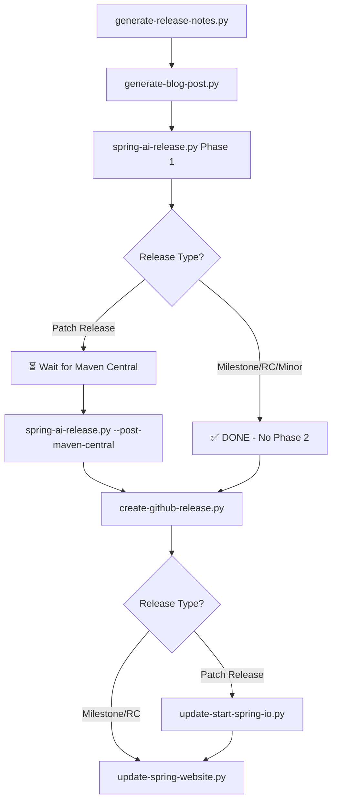

# Spring AI Release Automation

Complete automation tools for managing all Spring AI release types with step-by-step workflows.

## 🚀 Complete Release Ecosystem Overview

The Spring AI release process involves **multiple coordinated scripts** that handle different aspects:



### Core Scripts & Purpose

| Script | Purpose | When to Use |
|--------|---------|-------------|
| **`generate-release-notes.py`** | AI-powered release notes from commits/PRs | First step of any release |
| **`generate-blog-post.py`** | Release announcement blog content | After release notes |
| **`spring-ai-release.py`** | **Main release automation** - handles Maven Central, Git tags, GitHub Actions | Core release workflow |
| **`create-github-release.py`** | Creates GitHub releases with release notes | After successful Maven Central |
| **`update-start-spring-io.py`** | Updates Spring Initializr with new version | **PATCH RELEASES ONLY** - Not used for milestones/RCs |
| **`update-spring-website.py`** | Updates spring.io project documentation | Update official website |
| **`get-contributors.py`** | Contributor acknowledgment lists | For release notes (optional) |

## 🎯 Release Types & Phase 2 Requirements

### ❌ Phase 2 NOT Required
**Milestone** (1.1.0-M1), **RC** (1.1.0-RC1), **Minor** (1.1.0) releases:
- Target branch: `main`
- After Phase 1: `main` already has correct development version
- **Skip `--post-maven-central`** entirely

### ⚠️ Phase 2 REQUIRED  
**Patch** releases (1.0.1, 1.0.2):
- Target branch: `1.0.x` (maintenance branch)
- After Phase 1: `1.0.x` is "stuck" at release version `1.0.1`
- **Must run `--post-maven-central`** to set next dev version `1.0.2-SNAPSHOT`

## 📋 Complete Workflows by Release Type

### Milestone Release Workflow (1.1.0-M1)
```bash
# 1. Generate content
python3 generate-release-notes.py --branch main --target-version 1.1.0-M1
python3 generate-blog-post.py

# 2. Execute main release (COMPLETE workflow)
python3 spring-ai-release.py 1.1.0-M1 --dry-run  # Test first
python3 spring-ai-release.py 1.1.0-M1             # Execute

# ✅ Phase 1 COMPLETE - No Phase 2 needed for milestones!

# 3. External tasks (all run from /release directory)
python3 create-github-release.py v1.1.0-M1 --prerelease
# ❌ SKIP: python3 update-start-spring-io.py 1.1.0-M1  # Milestones not added to start.spring.io
python3 update-spring-website.py 1.1.0-M1
```

### Patch Release Workflow (1.0.1)
```bash
# 1. Generate content  
python3 generate-release-notes.py --branch 1.0.x --target-version 1.0.1
python3 generate-blog-post.py

# 2. Execute Phase 1 (stops at Maven Central trigger)
python3 spring-ai-release.py 1.0.1 --dry-run      # Test first
python3 spring-ai-release.py 1.0.1                # Execute Phase 1

# 3. ⏳ WAIT & VERIFY Maven Central deployment success
# Check: https://central.sonatype.com/artifact/org.springframework.ai/spring-ai-bom/1.0.1
# GitHub Actions: https://github.com/spring-projects/spring-ai/actions

# 4. Execute Phase 2 (updates maintenance branch)
python3 spring-ai-release.py 1.0.1 --post-maven-central

# 5. External tasks (all run from /release directory)
python3 create-github-release.py v1.0.1 --draft
python3 update-start-spring-io.py 1.0.1
python3 update-spring-website.py 1.0.1
```

## 🔧 Main Release Script: spring-ai-release.py

Automates the complete workflow for all Spring AI releases with automatic branch detection:

### Quick Start Examples
```bash
# Milestone releases (auto-detects main branch)
python3 spring-ai-release.py 1.1.0-M1 --dry-run
python3 spring-ai-release.py 1.1.0-M1

# Patch releases (auto-detects 1.0.x branch)  
python3 spring-ai-release.py 1.0.1 --dry-run
python3 spring-ai-release.py 1.0.1
# After Maven Central success:
python3 spring-ai-release.py 1.0.1 --post-maven-central

# Release candidate releases (auto-detects main branch)
python3 spring-ai-release.py 1.1.0-RC1

# Minor releases (auto-detects main branch)
python3 spring-ai-release.py 1.1.0
```

### Command Line Options
```
python3 spring-ai-release.py [OPTIONS] VERSION

Arguments:
  VERSION               Target release version (1.0.1, 1.1.0-M1, 1.1.0-RC1, 1.1.0)

Key Options:
  --branch BRANCH              Branch to release from (auto-detected by default)
  --dry-run                   Preview commands without executing them
  --post-maven-central         Complete development version setup after Maven Central success
  --workspace PATH             Override default workspace directory (./spring-ai-release)
  --check-maven-status         Check Maven Central infrastructure status and exit
  --skip-maven-status-check    Skip Maven Central status check entirely
  --skip-to STEP              Skip to specific workflow step
  --cleanup                   Clean up state files and workspace directory
  --help                      Show help message and exit

Release Types (auto-detected):
  PATCH (1.0.1, 1.0.2)    - Bug fixes from maintenance branch (auto: 1.0.x)
  MINOR (1.1.0)           - New features from main branch  
  Milestones (1.1.0-M1)   - Prereleases from main branch
  RC (1.1.0-RC1)          - Release candidates from main branch
```

## 📖 Two-Phase Release Process

### Phase 1: Main Release Workflow (10 Steps)
Executes release steps up to Maven Central trigger and **stops**:

1. **Setup Workspace** - Fresh git checkout in `./spring-ai-release`
2. **Set Release Version** - Updates all POM files, verifies no SNAPSHOT versions
3. **Build and Verify** - Fast compilation + documentation build  
4. **Commit Release Version** - Git commit with release version
5. **Create Release Tag** - Annotated tag `v1.0.1`
6. **Create Release Branch** - Dedicated branch `1.0.1` from tag
7. **Push Changes** - Pushes tag and release branch to remote
8. **Trigger Documentation Deployment** - GitHub Actions for docs
9. **Trigger Javadoc Upload** - GitHub Actions for API docs  
10. **Trigger Maven Central Release** - GitHub Actions for artifact publishing

**🛑 Phase 1 stops here** - State saved for Phase 2 resumption

### Phase 2: Post-Maven Central Workflow (3 Steps)
**Only run after Maven Central deployment succeeds** and **only for patch releases**:

11. **Set Next Development Version** - Updates to `1.0.2-SNAPSHOT`
12. **Commit Development Version** - Git commit with dev version
13. **Push All Changes** - Pushes maintenance branch with both commits

### Manual Steps: External Repository Updates
Steps handled by **standalone scripts** for better control:

14. **Update start.spring.io** - `python3 update-start-spring-io.py VERSION`
15. **Update spring-website-content** - `python3 update-spring-website.py VERSION`

## 🔍 Maven Central Verification

Before running Phase 2 (patch releases only), verify deployment success:

### Primary Verification URLs
- **Maven Central**: https://central.sonatype.com/artifact/org.springframework.ai/spring-ai-bom/YOUR_VERSION
- **Maven Search**: https://search.maven.org/search?q=g:org.springframework.ai%20AND%20v:YOUR_VERSION
- **Spring Milestones**: https://repo.spring.io/milestone/org/springframework/ai/spring-ai-bom/YOUR_VERSION/ (for milestone releases)

### GitHub Actions Status
Check the `new-maven-central-release.yml` workflow:
- **URL**: https://github.com/spring-projects/spring-ai/actions/workflows/new-maven-central-release.yml
- Filter by your release branch to see triggered workflow

**Typical Timeline**: Maven Central deployment takes 15-30 minutes after GitHub Actions completes.

## 🛡️ Safety Features

### Interactive Workflow with Command Transparency
The script shows **exactly what commands will be executed** before running them:

```
============================================================
SPRING AI RELEASE SUMMARY  
============================================================
[INFO] Release Type: MILESTONE
[INFO] Target Version: 1.1.0-M1
[INFO] Branch: main
[INFO] Workspace: ./spring-ai-release
[INFO] Dry Run: False
============================================================

[STEP] Execute: Setup workspace
[INFO] Commands that will be executed:
  1. git clone https://github.com/spring-projects/spring-ai.git ./spring-ai-release
  2. cd ./spring-ai-release
  3. git checkout main
  4. git pull origin main
  5. Initialize Maven and GitHub helpers

Proceed? (Y/n):
```

### Key Safety Mechanisms
- **Dry Run Mode** - Test with `--dry-run` to preview all operations
- **Step-by-step Confirmation** - Manual approval required for each step
- **Version Verification** - Comprehensive POM validation before proceeding
- **Build Verification** - Fast compilation and documentation build checks
- **Maven Central Status Check** - Monitors infrastructure health before deployment
- **Isolated Workspace** - Fresh checkout in `./spring-ai-release/` prevents conflicts
- **State Persistence** - Resume workflows after interruption using `./state/` files

## 🔧 External Repository Update Scripts

### update-start-spring-io.py
Updates Spring Initializr to make new Spring AI versions available for new projects:

```bash
# Preview changes (PATCH RELEASES ONLY)
python3 update-start-spring-io.py 1.0.1 --dry-run

# Execute with step-by-step confirmation  
python3 update-start-spring-io.py 1.0.1

# Clean up
python3 update-start-spring-io.py 1.0.1 --cleanup
```

**⚠️ IMPORTANT: PATCH RELEASES ONLY**
- **✅ Use for**: Patch releases (1.0.1, 1.0.2, etc.) 
- **❌ Do NOT use for**: Milestone releases (1.1.0-M1), RC releases (1.1.0-RC1)

**Why milestones are excluded**: Spring AI milestones run on stable Spring Boot versions (e.g., 1.1.0-M1 on Boot 3.5.0), but start.spring.io should only offer stable dependencies with stable Boot versions. Boot 4.x milestones get their own milestone dependencies (Spring Cloud 2025.1.0-M1), maintaining consistency.

**What it does**:
1. **Fresh clone** - Removes any existing checkout and clones https://github.com/spring-io/start.spring.io
2. **Fork workflow** - Clones your fork and syncs with upstream
3. **Updates Spring AI BOM** - Modifies `application.yml` compatibility mappings
4. **Creates pull request** - Safe review process, no direct commits to main

### update-spring-website.py  
Updates Spring AI project documentation on spring.io:

```bash
# Preview changes
python3 update-spring-website.py 1.0.1 --dry-run

# Execute with step-by-step confirmation
python3 update-spring-website.py 1.0.1

# Clean up  
python3 update-spring-website.py 1.0.1 --cleanup
```

**What it does**:
1. **Fresh clone** - Removes any existing checkout and clones https://github.com/spring-io/spring-website-content
2. **Feature branch** - Creates branch like `spring-ai-1.1.0-M1` from main
3. **Updates documentation** - Modifies `project/spring-ai/documentation.json`:
   - **Patch releases**: Updates existing GA entry (version + API URL)
   - **Milestone releases**: Adds new PRERELEASE entry with `antora:true`
4. **Commits with DCO** - Uses `git commit -s` for Developer Certificate of Origin compliance
5. **Creates pull request** - Pushes feature branch and creates PR (no direct commits to main)

### create-github-release.py
Creates GitHub releases using existing release notes. **Runs from `/release` directory** and automatically uses the `./spring-ai-release` workspace:

```bash
# Create draft release for review
python3 create-github-release.py v1.0.1 --draft

# Publish the release  
python3 create-github-release.py v1.0.1

# Milestone/RC releases (auto-detects prerelease)
python3 create-github-release.py v1.1.0-M1 --prerelease
```

**Self-Contained**: No need to change directories or specify paths - automatically finds tags and release notes in the workspace.

### update-spring-blog.py
Publishes Spring AI release blog posts to the spring.io blog:

```bash
# Preview changes
python3 update-spring-blog.py 1.0.3 spring-ai-1-0-3-available-now.md --dry-run

# Execute with step-by-step confirmation
python3 update-spring-blog.py 1.0.3 spring-ai-1-0-3-available-now.md

# Clean up
python3 update-spring-blog.py 1.0.3 spring-ai-1-0-3-available-now.md --cleanup
```

**What it does**:
1. **Fresh clone** - Removes any existing checkout and clones https://github.com/spring-io/spring-website-content
2. **Feature branch** - Creates branch for the blog post
3. **Copies blog post** - Places markdown file in `blog/YYYY/MM/` directory
4. **Commits with DCO** - Uses `git commit -s` for Developer Certificate of Origin compliance
5. **Creates pull request** - Pushes feature branch and creates PR

**After PR is merged**, watch the blog publish action at:
- **Blog Publishing**: https://github.com/spring-io/spring-website/actions

The blog post will be live on https://spring.io/blog after the GitHub Action completes (typically 5-10 minutes).

## 📁 Self-Contained Release Directory

The `/release` directory is **completely self-contained** - all scripts run from this directory and use the local `./spring-ai-release` workspace:

```
release/
├── spring-ai-release.py         # Main release automation
├── update-start-spring-io.py     # Spring Initializr updates
├── update-spring-website.py      # Spring website updates  
├── create-github-release.py      # GitHub release creation ✅ FIXED
├── generate-release-notes.py     # AI-powered release notes
├── generate-blog-post.py         # Release blog content
├── get-contributors.py          # Contributor lists
├── logs/                        # Build logs (gitignored)
├── spring-ai-release/           # Fresh checkout workspace (gitignored)
├── state/                       # Release state persistence (gitignored)
└── README.md                    # This file
```

### ✅ **No External Dependencies**
- **All commands run from `/release` directory**
- **Scripts automatically find `./spring-ai-release` workspace**
- **No need to change directories or specify git repository paths**
- **No hardcoded paths to external Spring AI checkouts**

### Automatic Cleanup
- **Workspace** (`spring-ai-release/`) - Recreated for each release
- **State files** (`./state/`) - Persist between phases, clean after successful releases
- **Build logs** (`./logs/`) - Accumulate over time, can be manually cleaned

## 📚 Content Generation Scripts

### generate-release-notes.py
AI-powered release notes with cross-branch backport analysis:

```bash
# Auto-detect commits since last release
python3 generate-release-notes.py --branch 1.0.x --target-version 1.0.1

# Specific version range
python3 generate-release-notes.py --since-version 1.0.0 --target-version 1.0.1

# Main branch analysis  
python3 generate-release-notes.py --branch main
```

**Features**:
- Analyzes commits, PRs, and issues from GitHub
- Links backported commits to original PRs
- AI categorization using Claude Code CLI
- Professional GitHub-flavored markdown output

### generate-blog-post.py
Creates comprehensive release announcement blog posts:

```bash
python3 generate-blog-post.py
```

**Features**:
- Uses AI synthesis for feature descriptions
- Integrates with ecosystem analysis
- Generates examples and code snippets

## 🆘 Error Handling & Recovery

### Common Issues
- **Permission Denied**: Check GitHub authentication (`gh auth login`)
- **Build Failures**: Check Maven output in `./logs/` directory
- **Version Conflicts**: Use `--cleanup` to reset workspace
- **GitHub CLI Issues**: Verify repository access and authentication

### Recovery from Failures
1. Check error messages for specific failure reason
2. Use `--cleanup` to reset workspace if needed
3. Test fixes with `--dry-run` before re-execution
4. Use `--skip-to STEP` to resume from specific workflow step

### Skip to Specific Steps
```bash
# Resume from Maven Central deployment
python3 spring-ai-release.py 1.0.1 --skip-to maven-central

# Skip to documentation workflows
python3 spring-ai-release.py 1.0.1 --skip-to docs
```

## 📋 Prerequisites

- **Python 3.7+** with required libraries
- **Git** configured with push access to `spring-projects/spring-ai`
- **Maven Daemon (`mvnd`)** recommended for builds (or Maven)
- **GitHub CLI (`gh`)** authenticated for repository operations
- **Claude Code CLI** for AI-powered content generation

## 🔗 Integration with Spring Release Process

This automation handles the **technical release steps** and **post-release automation**:

**Automated**:
- Version management and Git operations  
- Build verification and documentation checks
- GitHub Actions triggering (docs, javadocs, Maven Central)
- External repository updates (start.spring.io, spring-website-content)

**Manual Steps Still Required**:
- Release announcement and communication
- Monitoring GitHub Actions completion
- Blog post publishing and distribution

---

For detailed implementation information, troubleshooting guides, and advanced usage, see [IMPLEMENTATION_DETAILS.md](IMPLEMENTATION_DETAILS.md).